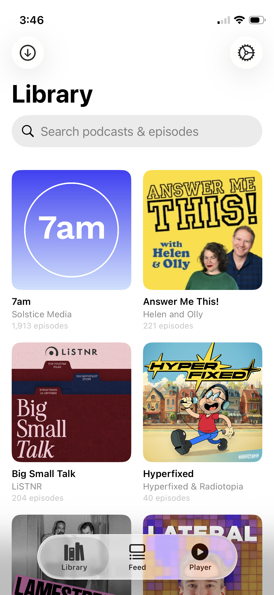
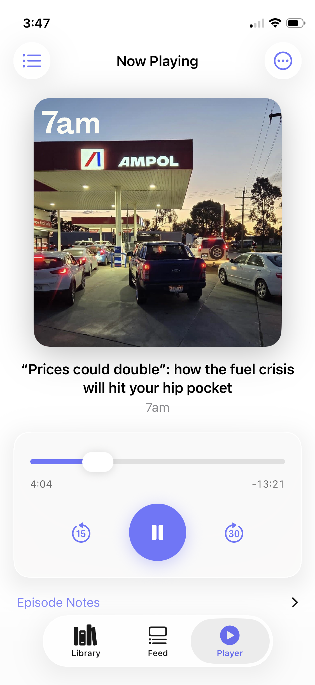
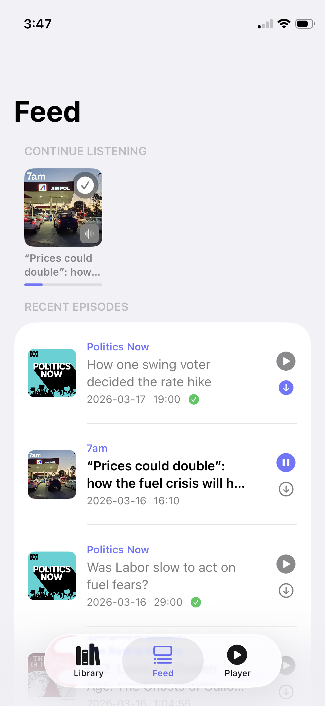

# PinePlay — iOS Client for Pinepods

| Library | Player | Feed |
|---|---|---|
|  |  |  |

An unofficial native iOS app for [Pinepods](https://github.com/madeofpendletonwool/PinePods), the self-hosted podcast manager. Built with SwiftUI, it gives you a clean mobile interface to your Pinepods server.

## Features

- **Library** — Grid view of all subscribed podcasts. Tap to browse episodes, swipe to mark played, download for offline listening.
- **Feed** — Latest episodes across all your podcasts. Pull to refresh, swipe right to download, left to mark played.
- **Continue Listening** — Horizontal card strip showing in-progress episodes with a progress bar. Tap to resume instantly.
- **Full-screen Player** — Artwork, scrub bar, skip back 15s / forward 30s, playback speed control, sleep timer.
- **Lock Screen & Control Centre** — Full Now Playing card with artwork, scrubbing, and skip controls via MPRemoteCommandCenter.
- **AirPods & Bluetooth** — Previous/next track gestures mapped to skip back/forward.
- **Per-show Accent Colours** — Auto-samples the dominant colour from artwork, or pick your own with the built-in colour picker (including an eyedropper to sample any pixel from the artwork).
- **Auto-download** — Optionally download new episodes automatically, with a Wi-Fi-only option and per-show controls.
- **Offline playback** — Downloaded episodes play without a network connection.
- **Progress sync** — Playback position saved to the server every 15 seconds, on pause, and on app background so you never lose your place.

## Requirements

- iOS 17+
- Xcode 15+
- A running [Pinepods](https://github.com/madeofpendletonwool/PinePods) server

## Setup

See [SETUP.md](SETUP.md) for full Xcode project setup instructions.

### Quick start

1. Clone this repo.
2. Open `PinePlay/PinePlay.xcodeproj` in Xcode.
3. Select your target device or simulator.
4. Build & run (`⌘R`).
5. Enter your Pinepods server URL and credentials on first launch.

## API

Communicates with the standard Pinepods REST API using an `Api-Key` header for authentication. No modifications to the server are required.

| Feature | Endpoint |
|---|---|
| Login | `GET /api/data/get_key` |
| Podcasts | `GET /api/data/return_pods/{user_id}` |
| Feed | `GET /api/data/return_episodes/{user_id}` |
| Podcast episodes | `GET /api/data/podcast_episodes` |
| Save progress | `POST /api/data/update_episode_duration` |
| Mark completed | `POST /api/data/mark_episode_completed` |
| Download | `POST /api/data/download_podcast` |
| History | `POST /api/data/record_podcast_history` |

## License

MIT

---

If you find this useful, please consider supporting the maintenance :)

