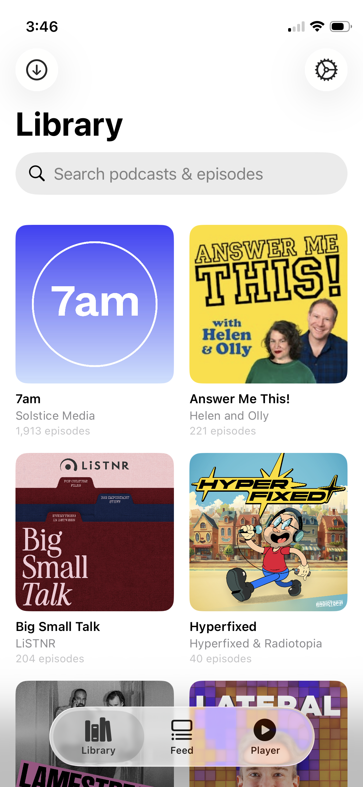
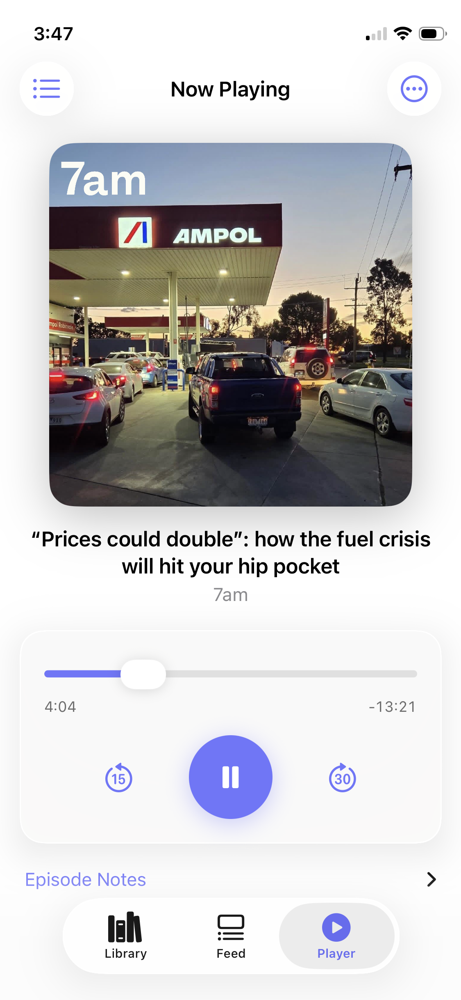
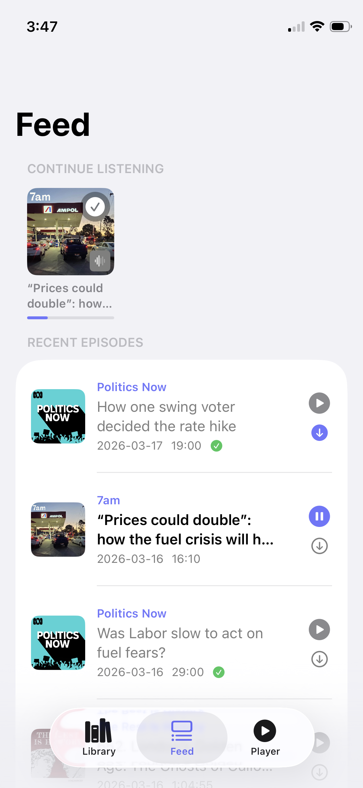

# PinePlay — iOS Client for Pinepods

| Library | Player | Feed |
|---|---|---|
|  |  |  |

An unofficial native iOS app for [Pinepods](https://github.com/madeofpendletonwool/PinePods), the self-hosted podcast manager. Built with SwiftUI, it gives you a clean mobile interface to your Pinepods server.

## Features

### Library & Discovery
- **Library** — Grid view of all subscribed podcasts. Tap to browse episodes, swipe to mark played, download for offline listening, or shuffle a show's episodes into the queue or downloads.
- **Staging Ground** — Search for a podcast by name or paste an RSS URL to preview a show before subscribing. Episodes play locally straight from the feed; promote the show into your real Pinepods library whenever you're ready.
- **Feed** — Latest episodes across all your podcasts. Pull to refresh, swipe right to download, left to mark played.
- **Continue Listening** — Horizontal card strip showing in-progress episodes with a progress bar. Tap to resume instantly, swipe to dismiss, or let it drop off on its own once an episode is under 30 seconds from finishing.

### Playback
- **Full-screen Player** — Artwork, scrub bar, skip back 15s / forward 30s, playback speed control, sleep timer, and parsed chapters with tap-to-seek.
- **Play Queue** — Add episodes to a queue, reorder or remove them, jump to "play next," and let playback auto-advance. The queue survives an app kill.
- **Reset Progress** — Reset an episode's listen position back to zero from its context menu.
- **State restoration** — The last-playing episode, its position, and the queue all survive iOS terminating the app.
- **Progress sync** — Playback position saved to the server every 15 seconds while playing, on pause, on app background, and on episode switch, so you never lose your place.

### Downloads & Offline
- **Downloads** — A dedicated screen with sort options, live download progress with cancel, multi-select delete, and total local storage used.
- **Auto-download** — Optionally download new episodes automatically, with a Wi-Fi-only option, per-show selection, and a max-episodes-per-show cap.
- **Offline Mode** — An explicit toggle that hides non-downloaded episodes and skips network calls; it also engages automatically when the device loses connectivity.

### Integrations & Personalisation
- **Lock Screen & Control Centre** — Full Now Playing card with artwork, scrubbing, and skip controls via MPRemoteCommandCenter, including hold-to-fast-forward/rewind up to 8x.
- **AirPods & Bluetooth** — Previous/next track gestures mapped to skip back/forward.
- **Siri Shortcuts** — Play a show's latest episode, resume playback, hear what's new, add to queue, play next, shuffle a show, or download the latest episode — all by podcast name.
- **Per-show Accent Colours** — Auto-samples the dominant colour from artwork, or pick your own with the built-in colour picker (including an eyedropper to sample any pixel from the artwork).

## Requirements

- iOS 17.6+
- Xcode 15+
- A running [Pinepods](https://github.com/madeofpendletonwool/PinePods) server

## Setup

See [SETUP.md](SETUP.md) for full Xcode project setup instructions.

### Quick start

1. Clone this repo.
2. Open `PinePlay/PinePlay.xcodeproj` in Xcode.
3. Select your target device or simulator.
4. Build & run (`⌘R`).
5. Enter your Pinepods server URL and credentials on first launch.

## API

Communicates with the standard Pinepods REST API using an `Api-Key` header for authentication. No modifications to the server are required.

| Feature | Endpoint |
|---|---|
| Login | `GET /api/data/get_key` (Basic Auth) |
| Podcasts | `GET /api/data/return_pods/{user_id}` |
| Subscribe to podcast | `POST /api/data/add_podcast` |
| Feed / recent episodes | `GET /api/data/return_episodes/{user_id}` |
| Podcast episodes | `GET /api/data/podcast_episodes` |
| Server downloads list | `GET /api/data/download_episode_list` |
| Request server download | `POST /api/data/download_podcast` |
| Delete server download | `POST /api/data/delete_episode` |
| Save progress | `POST /api/data/update_episode_duration` |
| Mark completed | `POST /api/data/mark_episode_completed` |
| Mark uncompleted | `POST /api/data/mark_episode_uncompleted` |
| Record history | `POST /api/data/record_podcast_history` |

---

If you find this useful, please consider supporting the maintenance :)

